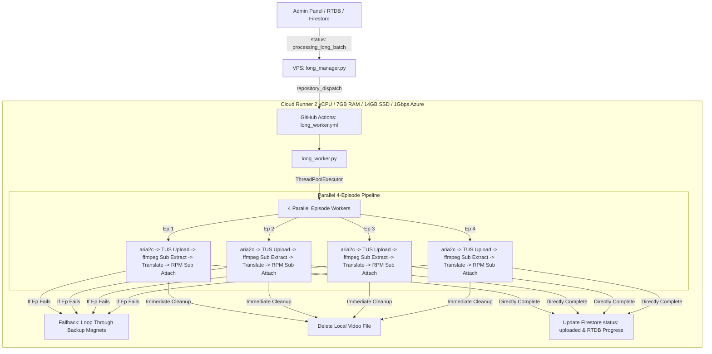

# 🎬 AniShift Long Anime Cloud Worker (`long_manager`)

[](https://www.python.org/)
[](https://github.com/features/actions)
[](https://aria2.github.io/)
[](https://tus.io/)
[](https://firebase.google.com/)

A cloud-native, high-speed anime mega-batch processing pipeline for **AniShift Server 2** (One Piece, Naruto, Bleach, Detective Conan, etc.). Completely eliminates torrent bandwidth bottlenecks and disk constraints by executing on GitHub Actions (1Gbps+ Azure Network, 14GB SSD, 7GB RAM).

---

## ⚡ Key Highlights

* **4-Episode Parallel Concurrency**:
  * Utilizes `ThreadPoolExecutor(max_workers=4)` to download 4 episodes via `aria2c` and upload via `TUS` simultaneously.
* **Automatic Backup Magnet Fallback**:
  * If an episode in the main torrent is missing, stalled, or corrupt, the pipeline automatically searches and downloads from the configured `backup_magnets`.
* **Integrated Subtitle Engine (All-In-One)**:
  * Automatically extracts embedded subtitle tracks directly from the downloaded MKV/MP4 using `ffmpeg`.
  * Cleans English dialogue and uploads `English.srt` to GitHub Releases (DDL).
  * Translates to natural Sinhala using the Spoken Sinhala dictionary.
  * Uploads `Sinhala.srt` to GitHub Releases and attaches it to the RPMShare video via API.
  * Directly updates episode documents to **`status: 'uploaded'`** — no secondary bot needed!
* **Zero-Waste Disk Management**:
  * Each episode uses an isolated working directory (`downloads_long/ep_XXXX`) and is deleted immediately upon successful upload. Disk usage never exceeds ~1.5GB.
* **VPS Zero-Load**:
  * VPS runs a lightweight listener daemon (~20MB RAM, 0% CPU), protecting server resources completely.

---

## 🏗️ Architecture Workflow



---

## 🔑 Required GitHub Actions Secrets

Add the following secret keys under your GitHub Repository **Settings -> Secrets and variables -> Actions**:

| Secret Name | Description | Example / Value |
| :--- | :--- | :--- |
| `FIREBASE_JSON` | Full contents of your `serviceAccountKey.json` | `{ "type": "service_account", ... }` |
| `FIREBASE_DB_URL` | Firebase Realtime Database URL | `https://anishift-5d14b-default-rtdb.firebaseio.com/` |
| `RPMSHARE_API_TOKEN_2` | Server 2 RPMShare API Token | `89b031f1929930a6f8296f61` |
| `RPMSHARE_API_TOKEN` | Server 1 Fallback Token | `dea33865f43384df9ae87cd5` |
| `SUB_GITHUB_TOKEN` | GitHub Personal Access Token (repo scope for DDL releases) | `ghp_...` |
| `SUB_GITHUB_REPO` | Subtitle Releases Storage Repository | `Anishift-svr/sub-vault-160633` |

---

## 📁 Repository Structure

```
├── .github/workflows/
│   └── long_worker.yml     # GitHub Actions cloud runner definition
├── workflow.yml            # Local backup of the workflow file
├── long_manager.py         # VPS daemon dispatcher & batch monitor
├── long_worker.py          # Cloud 4-parallel batch worker & sub engine
├── sub_engine.py           # Universal subtitle processing core
├── spoken_dict.py          # Sinhala spoken vocabulary mapping
├── proxies.txt             # Optional proxy pool
├── .env                    # Local configuration & secrets reference
└── README.md               # Documentation
```

---

## 🚀 Running on VPS via PM2

To start the ultra-lightweight manager on your VPS:

```bash
# Start with PM2
pm2 start long_manager.py --name "RPM-S2-LongManager" --interpreter python3

# Save configuration
pm2 save
```

---

## 🛡️ License & Credits
Developed exclusively for **AniShift**. All rights reserved.
